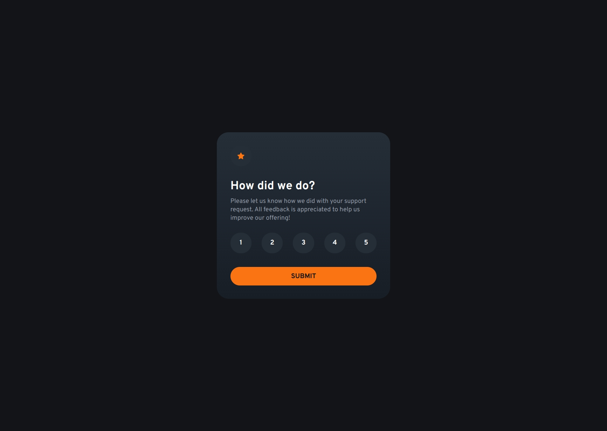
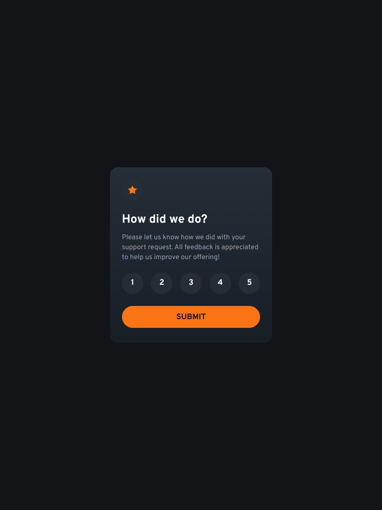
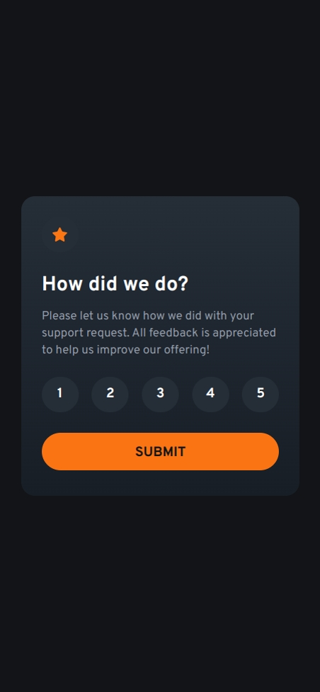

# Frontend Mentor - Interactive rating component solution

This is a solution to the [Interactive rating component challenge on Frontend Mentor](https://www.frontendmentor.io/challenges/interactive-rating-component-koxpeBUmI). Frontend Mentor challenges help you improve your coding skills by building realistic projects.

## Table of contents

- [Frontend Mentor - Interactive rating component solution](#frontend-mentor---interactive-rating-component-solution)
  - [Table of contents](#table-of-contents)
  - [Overview](#overview)
    - [The challenge](#the-challenge)
    - [Screenshot](#screenshot)
    - [Links](#links)
  - [My process](#my-process)
    - [Built with](#built-with)
    - [What I learned](#what-i-learned)
    - [Continued development](#continued-development)
  - [Author](#author)

## Overview

### The challenge

Users should be able to:

- View the optimal layout for the app depending on their device's screen size
- See hover states for all interactive elements on the page
- Select and submit a number rating
- See the "Thank you" card state after submitting a rating

### Screenshot





### Links

- Solution URL: [GitHub](https://github.com/adamskiee-frontendmentor-projects/interactive-rating-component)
- Live Site URL: [Live Site URL](https://adamskiee-frontendmentor-projects.github.io/interactive-rating-component)
- Figma URL: [Figma URL](https://www.figma.com/design/W1Vln1xtcv5ZgszecpuhSA/Interactive-Rating-Component?node-id=0-1&p=f&t=SRvtlMNWaLcag1Cp-0)

## My process

### Built with

- Semantic HTML5 markup
- CSS custom properties
- Flexbox
- CSS Grid
- Mobile-first workflow
- [Tailwind](https://tailwindcss.com) - CSS Framework

### What I learned

- Using fieldset instead of list for accessibility

```html
<fieldset class="rates" role="group" aria-label="Rate options" aria-describedby="rating-error">
    <legend class="sr-only">Rate this support request</legend>
    <!-- ...existing code... -->
</fieldset>
```

- Working with accessibly button

```html
<button class="btn rate-btn circle" type="button" name="rate" value="1" aria-pressed="false"><span class="btn-text">1</span></button>
```

- Using class in handling user interactions

```js
class RatingComponent{
    // ...Existing code...
}
document.addEventListener("DOMContentLoaded", () =>{
    new RatingComponent();
})
```

### Continued development

1. I want to explore more assisstive technologies that can help me to develop efficient websites

## Author

- Website - [Add your name here](https://www.your-site.com)
- Frontend Mentor - [@Adamskiee](https://www.frontendmentor.io/profile/Adamskiee)
- Twitter - [@yourusername](https://www.twitter.com/yourusername)
